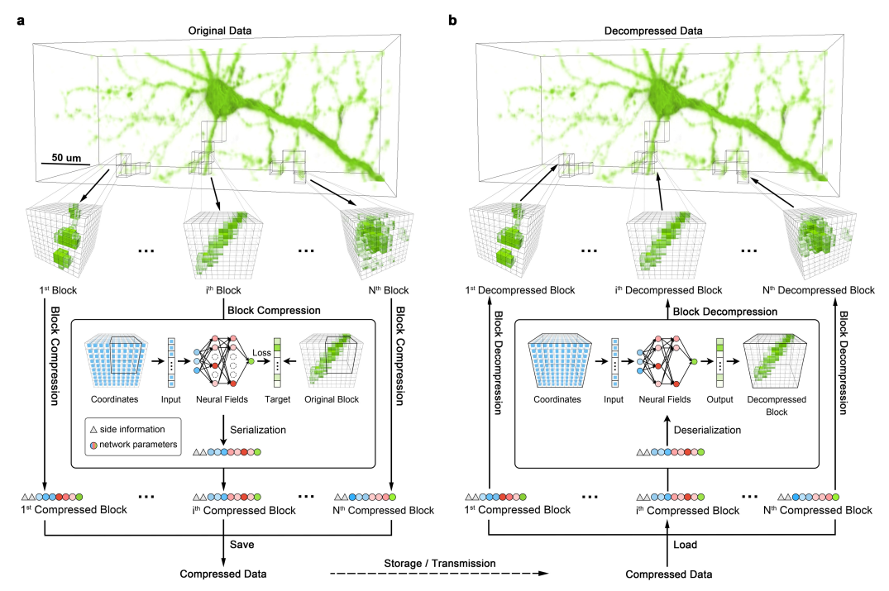
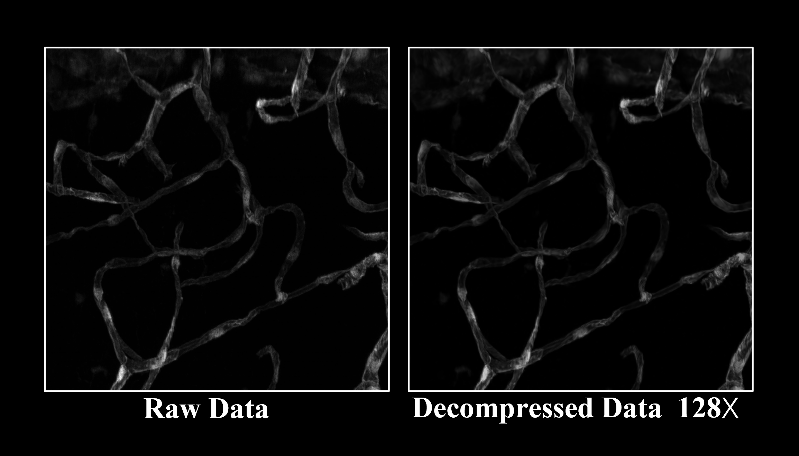
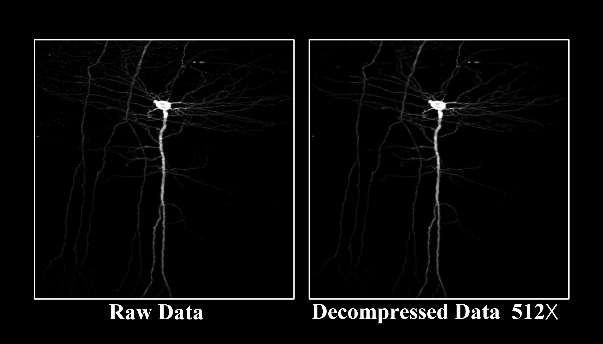
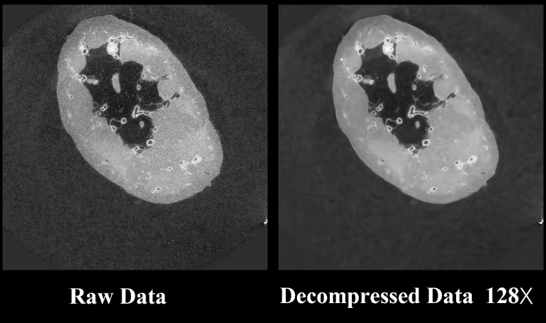

# 💾Biomedical data compRession with Implicit nEural Function (BRIEF)
### [\<Paper Link\>](https://www.biorxiv.org/content/10.1101/2022.12.03.518948v1) [\<PyTorch Implementation\>](https://github.com/RichealYoung/BRIEF_PyTorch.git)

Welcome to BRIEF! This repository is aimed at helping researchers or developers interested in BRIEF data compression algorithms to quickly understand and reproduce our latest research.

## Biological data


## Medical data


## Scheme



# 🚀Quickstart
## System requirements
- Ubuntu Linux (20.04.4 LTS)
- CUDA Toolkit (>=11.3)
- Anaconda3
- CMAKE
## Installation guide

### 1. Download project
```
git clone https://github.com/RichealYoung/BRIEF_CUDA
cd BRIEF_CUDA
```

### 2. Prepare the Ubuntu enviroments
Install packages
```
sudo apt-get update
sudo apt-get install build-essential libtiff-dev
sudo apt install cmake
```
Compile from source (about 4 minutes)
```
cmake . -B build 
cmake --build build --config Release -j
```
If it reports 'CMAKE_CUDA_ARCHITECTURES must be non-empty if set', or 'No CMAKE_CUDA_COMPILER could be found', please execute the following command if your nvcc is installed in **/usr/local/cuda/bin/nvcc**
```
rm -r build
cmake . -B build -DCMAKE_CUDA_COMPILER=/usr/local/cuda/bin/nvcc
cmake --build build --config Release -j
```

### 3. Prepare the Conda enviroments
```
conda create -n brief python=3.10
conda activate brief
pip install -r requirements.txt
```
Note that there may exist several version of cmake, like **/usr/bin/cmake** or **/anaconda3/envs/brief/bin/cmake** (if you're in a Conda enviroment).

### 4. Register Gurobi and get license
[Register and install an academic license](https://www.gurobi.com/downloads/free-academic-license/) 
for the Gurobi optimizer (this is free for academic use).

## Usage Guide

### 1. Compress data without any partitioning strategy
```
python main.py -p opt/SingleTask/default.yaml -g 0
```
- The compressed result will be located in : **outputs/single\_\${time}/compressed/**

- The decompressed data will be located in : **outputs/single\_\${time}/decompressed/\${name}\_decompressed.tif**

- To visualize the compressing process: 
```
tensorboard --logdir=outputs/single_${time}
```
- Relevant hyper-parameters can be modified in **opt/SingleTask/default.yaml**.
### 2. Compress data with adaptive partitioning
- Assume the available GPUs' indexs are 0,1,2,3
```
python main.py -p opt/DivideTask/default.yaml -g 0,1,2,3
```
- The compressed result will be located in : **outputs/divide\_\${time}/compressed/**

- The decompressed data will be located in : **outputs/divide\_\${time}/decompressed/\${name}\_decompressed.tif**

- To visualize the compressing process: 
```
tensorboard --logdir=outputs/divide_${time}
```
- Relevant hyper-parameters can be modified in **opt/DivideTask/default.yaml**.
### 3. Compress multiple data at once
- Assume the available GPUs' indexs are 0,1,2,3
```
python MultiTask.py -stp main.py -p opt/MultiTask/default.yaml -g 0,1,2,3
```
- The compressed result will be located in : **outputs/\${project}\_\${time}/compressed/**

- The decompressed data will be located in : **outputs/\${project}\_\${time}/decompressed/\${name}\_decompressed.tif**

- To visualize the compressing process: 
```
tensorboard --logdir=outputs/${project}_${time}
```
- Relevant hyper-parameters can be modified in **opt/MultiTask/default.yaml**.
### 4. Deblock

We provide a Python version **deblock.py** and a C++ version **deblock.cpp**. Some important parameters like **index_a**, **index_b**, and **thres** can be modified in the source file.

#### (1) Python version
To reduce the blocking artifacts of decompressed data that was partitioned
```
python deblock.py -stp outputs/${project}_${time}
```
The deblocked result will be located in : **outputs/\${project}\_\${time}/deblock**
#### (2) C++ version
Compile the source file
```
g++ deblock.cpp -o deblock -ltiff
```
To reduce the blocking artifacts of decompressed data that was partitioned
```
./deblock outputs/${project}_${time}
```
The deblocked result will be located in : **outputs/\${project}\_\${time}/deblock**

## Demo for Biomedical Data

### 1. Vessels
```
python main.py -p opt/DivideTask/vessel.yaml -g 0,1,2,3
```


### 2. Neurons
```
python main.py -p opt/DivideTask/neuron.yaml -g 0,1,2,3
```


### 3. Organic CT
```
python main.py -p opt/DivideTask/hipct.yaml -g 0,1,2,3
```


# Citations
```
@article{brief,
  author  = {Runzhao Yang  and Tingxiong Xiao  and Yuxiao Cheng  and Anan Li  and Jinyuan Qu  and Rui Liang  and Shengda Bao  and Xiaofeng Wang  and Jue Wang  and Jinli Suo  and Qingming Luo  and Qionghai Dai },
  journal = {Proceedings of the National Academy of Sciences (PNAS)},
  number  = {28},
  pages   = {e2320870121},
  title   = {{Sharing Massive Biomedical Data at Magnitudes Lower Bandwidth Using Implicit Neural Function}},
  volume  = {121},
  year    = {2024}
}
```
# Contact
If you need any help or are looking for cooperation feel free to contact us.
yangrz20@mails.tsinghua.edu.cn
